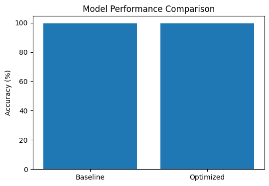
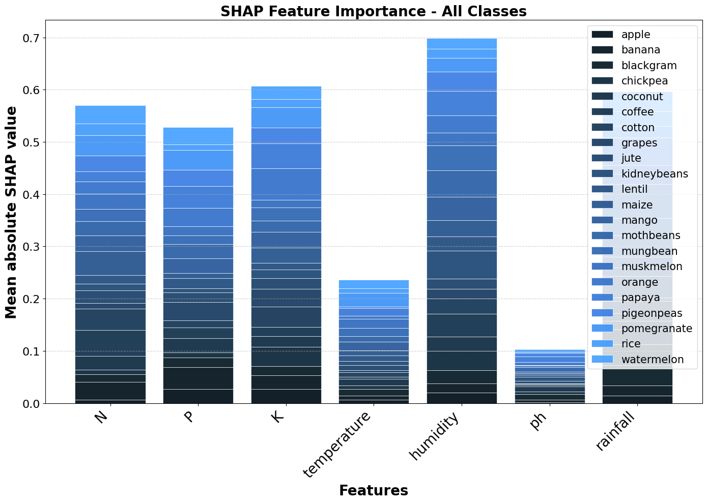

# 🌱 Machine Learning-Based Crop Recommendation System


## 🌐 Live Demo

👉[ https://your-app-name.streamlit.app](https://crop-recommendation-system-i7lezi9gbxrqmxs2cxqrwh.streamlit.app/)

---

## 📌 Overview
This project demonstrates an end-to-end machine learning pipeline from data preprocessing to deployment.
It is a Machine Learning-based system that recommends the most suitable crop based on soil nutrients and environmental conditions.

It uses a **Random Forest model**, optimized using **SMOTE** and **GridSearchCV**, and enhanced with **SHAP** for model interpretability.
The system is deployed as a live web application using Streamlit.

---

## ⚙️ Tech Stack

* Python
* Scikit-learn
* Pandas, NumPy
* Matplotlib
* SHAP (Model Interpretability)
* Imbalanced-learn (SMOTE)
* Streamlit (Deployment)

---

## 🧠 Machine Learning Workflow

1. Data preprocessing and feature extraction
2. Label encoding and feature scaling
3. Train-test split
4. Baseline model training
5. Handling class imbalance using SMOTE
6. Hyperparameter tuning using GridSearchCV
7. Model evaluation and comparison
8. Model interpretability using SHAP

---

## 📊 Model Performance

📌 The optimized model achieved higher accuracy compared to the baseline, validating the effectiveness of SMOTE and hyperparameter tuning.

| Model           | Accuracy |
| --------------- | -------- |
| Baseline Model  | 97.95%   |
| Optimized Model | 99.55%   |

📈 **Improvement: +1.59%**

✔ Improved performance using:

* SMOTE (handling class imbalance)
* GridSearchCV (hyperparameter tuning)

---

## 📸 Key Visualizations

### 📊 Model Performance Comparison



### 🔍 SHAP Feature Importance (Multi-Class Analysis)



## 🌾 Features

* Predicts best crop using soil and climate data
* Uses Random Forest for accurate classification
* Handles class imbalance using SMOTE
* Optimizes performance using GridSearchCV
* Provides model interpretability using SHAP
* Includes rule-based correction for extreme dry conditions
* Deployed as a live web application

---

## ⚠️ Smart Edge Handling

To improve real-world accuracy, the system includes rule-based logic:

* Detects extreme dry conditions
* Suggests drought-resistant crops (like millet)
* Prevents unrealistic predictions

---

## 💡 Example Input

```python
{
    'N': 90,
    'P': 40,
    'K': 40,
    'temperature': 26,
    'humidity': 85,
    'ph': 6.5,
    'rainfall': 250
}
```

---

## 📦 Output Example

```
🌾 Recommended Crop: Rice
```

---

## 📊 Dataset

The dataset includes soil nutrients and environmental parameters:

* Nitrogen (N)
* Phosphorus (P)
* Potassium (K)
* Temperature
* Humidity
* pH
* Rainfall

Used to train and evaluate the crop recommendation model.

---

## 📁 Project Structure

```
crop-recommendation-system/
│
├── app.py
├── crop_production.py
├── requirements.txt
├── README.md
│
├── models/
│   ├── adaptive_crop_recommender_model.pkl
│   ├── scaler.pkl
│   └── label_encoder.pkl
│
├── data/
│   └── crop_recommendation.csv
│
└── assets/
    ├── accuracy.jpg
    ├── shap_feature_importance.png
    └── graph.png
```

---

## 🚀 How to Run Locally

```bash
pip install -r requirements.txt
python crop_production.py
streamlit run app.py
```

---

## 📈 Future Improvements

* Add more real-world datasets
* Region-specific recommendations
* Mobile-friendly UI
* Integration with weather APIs

---

## 🤝 Contribution

Contributions are welcome! Feel free to fork this repository and improve it.

---

## ⭐ Acknowledgment

Inspired by real-world agricultural challenges and the need for smart farming solutions using AI.


## 📬 Contact

If you like this project, consider giving it a ⭐ on GitHub!

